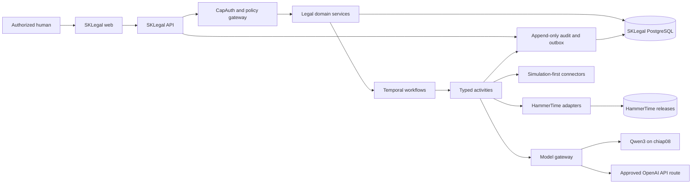
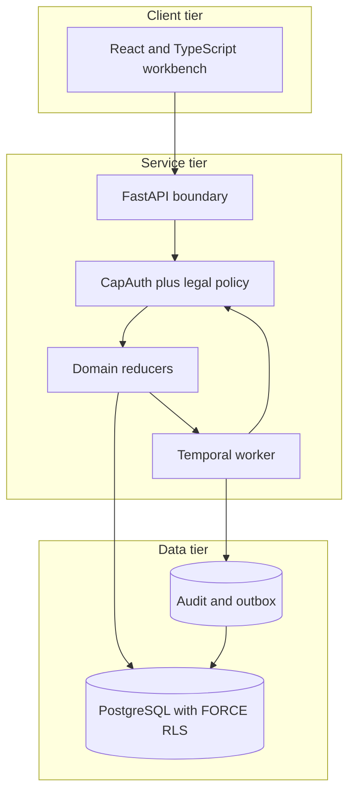
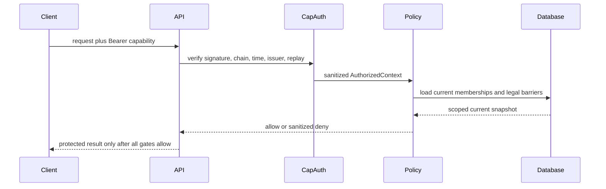

# SKLegal Standard Operating Procedures

SKLegal is the governed legal operations platform for the SK sovereign stack. This
document is the operational source of truth for building, testing, reviewing, and
deploying the repository without bypassing its authorization or evidence boundaries.

Canonical home: <https://skgit.skstack01.douno.it/smilinTux/sklegal>

Canonical local workspace: `/mnt/cloud/onedrive/projects/DAVE-AI/sklegal`. The former
`DAVE-AI/hammerTime-OS` directory is retired. HammerTime corpus data and shared source
checkouts remain separate dependencies and must not be moved into this repository.

## 1. Overview

### Purpose

SKLegal owns legal operational state for tenants, clients, engagements, matters,
parties, evidence, claims, work products, approvals, tasks, communications, execution
records, and audit evidence. It uses CapAuth for signed capability credentials and
applies independent SKLegal policy checks before protected data or actions are
available.

### What this repository owns

| Surface | Canonical location |
|---|---|
| Legal domain and state machines | `packages/domain/` |
| PostgreSQL schema, RLS, and controlled writers | `migrations/`, `packages/persistence/` |
| Capability and policy enforcement | `packages/capauth/`, `packages/policies/` |
| Audit, outbox, and telemetry contracts | `packages/audit/` |
| API and worker composition | `services/api/`, `services/worker/` |
| Web workbench | `apps/web/` |
| Deployment definitions | `deploy/chiap01/` |
| Approved architecture and evidence | `docs/` |

### Canonical repository layout

```text
sklegal/
  apps/                 browser applications
  services/             API and workflow worker composition
  packages/             domain, persistence, authorization, policy, audit, and adapters
  migrations/           ordered PostgreSQL schema and security changes
  deploy/chiap01/       reviewed development and deployment definitions
  docs/                 current specifications, operations, evidence, and legacy provenance
  tests/                unit, contract, and disposable integration tests
  config/               reviewed provenance and build configuration
  scripts/              reproducible checks and administrative tooling
```

`docs/legacy/` is non-normative. Current behavior is governed by the approved
architecture, development contracts, migrations, tests, and evidence linked from
`docs/PROJECT-SPEC.md`.

### What this repository does not own

- HammerTime source originals, promoted releases, or arbitrary HammerTime paths.
- SKCapstone coordination records or SKMemory continuity state.
- Model authority, human approval authority, or connector credentials.
- Production activation of any external action merely because connector code exists.
- A complete production workbench or completed pilot migration at version 0.1.0.

## 2. Architecture

### System context



### Component view



### Protected data flow

```mermaid
flowchart LR
    Request[Capability plus request scope<br/>highly restricted credential] -->|OpenPGP verify, T0 classical| Auth[CapAuth verifier]
    Auth -->|sanitized authorized context| Policy[Legal policy gateway]
    Policy -->|tenant and matter bound query| RLS[(PostgreSQL FORCE RLS<br/>protected legal data)]
    RLS -->|authorized records only| Bundle[Typed evidence bundle<br/>classified legal data]
    Bundle -->|approved local route| Qwen[Qwen3 proposal]
    Bundle -->|separately approved egress| External[External model proposal]
    Qwen --> Reducer[Deterministic reducer]
    External --> Reducer
    Reducer -->|exact version and human gate| State[(Legal state plus audit)]
```



The OpenPGP credential surface is classical and T0. PostgreSQL transport, tailnet,
browser transport, and model-provider transport are separate surfaces and are not
described as post-quantum. See [the crypto inventory](docs/crypto-architecture.md).

### Critical authorization sequence



### Start here

1. `docs/architecture/SKLEGAL-HIGH-LEVEL-TDD.md`: approved product and system
   architecture.
2. `packages/domain/src/sklegal_domain/entities.py`: canonical legal entities and
   state invariants.
3. `packages/capauth/src/sklegal_capauth/authorization.py`: capability decision
   boundary.
4. `packages/policies/src/sklegal_policies/engine.py`: conflict, wall, privilege,
   retention, and hold decisions.
5. `migrations/`: durable PostgreSQL ownership, RLS, controlled writers, audit, and
   policy state.

## 3. Build

### Toolchain

| Tool | Required line |
|---|---|
| Python | 3.12 |
| uv | Pinned by `scripts/bootstrap.sh` |
| Node.js | 22.23.2 in CI |
| npm | Lockfile-driven install |
| Docker | Required for disposable PostgreSQL and development dependencies |

Bootstrap the exact workspace:

```bash
./scripts/bootstrap.sh
```

The workspace is not published as one package. Python services and packages are uv
workspace members, and the web application builds through Vite. Reproducible build,
lint, type, SBOM, and package checks are part of `make check`.

## 4. Test

Run the merge gate:

```bash
make check
```

The gate verifies approved design hashes, dependency locks, licensing and provenance,
formatting, lint, Python and TypeScript types, frontend build, unit tests, disposable
PostgreSQL integration, migration reversibility, fixture safety, SBOM generation,
secret scanning, and Python plus npm vulnerability reports.

Useful focused commands:

```bash
make unit-test
make integration-test
make migration-check
make secret-scan
make vulnerability-scan
```

`make clean-room-check` is a separate host-backed qualification boundary. It requires
the documented systemd, Landlock, Docker broker, and local scratch prerequisites. Do
not represent an ordinary `make check` as clean-room evidence.

## 5. Release / Deploy

### Source release

The source of truth is the private GitHub repository. Changes use a feature branch and
pull request after the initial repository bootstrap. A merge requires the local gate
and GitHub Actions to pass. Version changes update `pyproject.toml`, package manifests,
and `CHANGELOG.md` together.

### Current deployment posture

The repository includes loopback-only development dependencies and an initial
chiap01 PostgreSQL definition. It does not yet publish a production API, web service,
worker, model route, or external-action connector. Production activation requires its
assigned SKCapstone card, current secrets and policy backends, health evidence, and a
rollback receipt.

Development dependencies:

```bash
make dev-deps
make dev-deps-check
make dev-deps-down
```

Rollback a source change by reverting its commit through review. Database rollback
uses only the tested migration runner and refuses destructive down migration while
protected data exists unless the migration's explicit guard permits it.

### Front-end / Exposure

Current committed application exposure: N/A. No production listener is activated by
this repository state. Development PostgreSQL and Temporal bind to
`127.0.0.1:15433` and `127.0.0.1:17233`. Future public exposure must use the approved
unified ingress tier and declare exact `:443` routes before activation.

## 6. Configuration / Usage

| Configuration | Rule |
|---|---|
| `.env` and `.env.*` | Local only and ignored, except reviewed `.env.example` files |
| `deploy/chiap01/postgres.env` | Owner-controlled local deployment input, never committed |
| Trusted issuer policy | `deploy/chiap01/issuer-policy/trusted-issuers.json` |
| Governance signature | `deploy/chiap01/issuer-policy/trusted-issuers.json.asc` |
| Database runtime identity | Exact provisioned role and principal binding, never profile ownership |
| Model credentials | Secret-store reference only, never prompt or workflow history |

Raw capability credentials, private keys, passphrases, protected prompts, and client
material must not enter Git, logs, exception text, browser storage, ordinary telemetry,
or board receipts.

## 7. API / Reference

SKLegal 0.1.0 exposes internal package contracts but no supported public HTTP API.
Primary internal entry points:

| Entry point | Purpose |
|---|---|
| `sklegal_domain` | Immutable legal entities, values, and transitions |
| `sklegal_persistence` | Strict normalized reconstruction and decomposition |
| `sklegal_capauth` | Signed capability parsing, issuance, delegation, and authorization |
| `sklegal_policies` | Legal information-barrier and retention decisions |
| `sklegal_audit` | Durable audit, outbox, projection, and telemetry contracts |
| `sklegal_api.capauth` | FastAPI protected-route dependency and production composition seam |

The exact 26-capability vocabulary and four audiences are documented in
`docs/development/CAPAUTH.md`. Models and connectors receive only a sanitized,
scope-bound authorization context.

## 8. Troubleshooting

| Symptom | Check |
|---|---|
| `make check` cannot find uv or node dependencies | Run `./scripts/bootstrap.sh`, then rerun the failed focused gate |
| Secret scan reports a public fingerprint or manifest digest | Confirm the value is public, review the exact finding, and update only the reviewed baseline entry |
| Disposable PostgreSQL test fails to start | Run `docker ps -a` and verify no stale container uses the SKLegal test label or loopback port |
| Runtime sees zero protected rows | Verify current tenant, principal, role binding, membership, policy revision, and matter scope; do not bypass RLS |
| Capability is denied | Verify audience, target, capability, exact resource, purpose, issuer policy, principal state, revocation, expiry, and replay state |
| Trusted issuer policy is unavailable | Verify the exact regular file, ownership, link count, JSON schema, and current signed policy receipt |
| Clean-room gate exits before tests | Read its terminal JSON receipt and correct the named host prerequisite; do not relabel a normal check as clean-room evidence |

## 9. Maturity-tier + Version reference

- Maturity tier: **T0 Classical** for the signed capability surface.
- Version lifecycle: **Active v2** development line.
- Current SemVer: **0.1.0**.
- License: **GNU GPL version 3 only**, retained from the approved architecture.
- Cryptography standard posture: classical RSA/OpenPGP signatures are delegated to
  CapAuth and GnuPG. SKLegal has no active suite registry or hybrid KEM/signature
  surface and makes no T1 through T4 claim.
- Assurance posture: experimental and unaudited. Tests are evidence for named
  behavior, not an independent security audit.

<!-- docs-evidence
verified: 2026-08-21
checks:
  - name: workspace version and GPL license remain documented facts
    run: python3 -c "import tomllib; p=tomllib.load(open('pyproject.toml','rb')); assert p['project']['version']=='0.1.0' and p['project']['license']=='GPL-3.0-only'"
  - name: approved architecture hashes remain exact
    run: sha256sum --check docs/approval/DESIGN-HASHES.sha256
  - name: development dependencies remain loopback only
    run: grep -q '127.0.0.1:15433:5432' deploy/chiap01/compose.dev.yml && grep -q '127.0.0.1:17233:7233' deploy/chiap01/compose.dev.yml
  - name: trusted issuer policy and governance signature remain paired
    run: test -f deploy/chiap01/issuer-policy/trusted-issuers.json && test -f deploy/chiap01/issuer-policy/trusted-issuers.json.asc
  - name: canonical package entry points remain present
    run: test -f packages/domain/src/sklegal_domain/entities.py && test -f packages/capauth/src/sklegal_capauth/authorization.py && test -f packages/policies/src/sklegal_policies/engine.py && test -f packages/audit/src/sklegal_audit/ledger.py
-->
