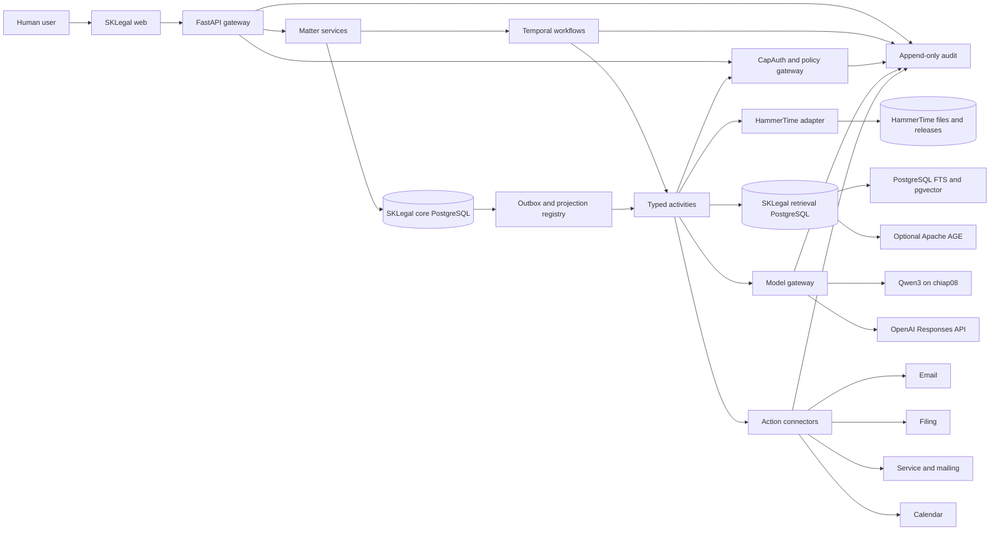

# SKLegal high-level technical design document

Date: 2026-08-19  
Status: Approved, retrieval architecture amended 2026-08-21
Deployment target: chiap01  
Pilot source: HammerTime matter `PRB-2026-009`, legacy event `INC-016`

## 1. Executive decision

SKLegal will be a multi-tenant-capable legal operations application with a React workbench, FastAPI service layer, PostgreSQL operational database, Temporal workflows, CapAuth authorization, typed agent activities, and governed integrations with HammerTime.

HammerTime is not replaced. During the first release it remains the canonical owner of corpus sources, original matter artifacts, normalized and decomposed content, release manifests, and existing process outputs. SKLegal becomes the canonical owner of clients, engagements, matters, parties, conflicts, access walls, workflow state, tasks, deadlines, claims, work products, approvals, connector dispatches, and audit events.

The UI and APIs cut over immediately to legal terminology. Existing `PRB-*`, `INC-*`, slugs, paths, hashes, and packet versions remain immutable provenance aliases.

## 2. Confirmed requirements

1. The product and frontend name is SKLegal.
2. The architecture supports law-firm-style multi-tenancy.
3. Casey, David, family members, trusts, trustees, and future external organizations can be represented without sharing records by default.
4. The Liberty Auto Plaza record is the first controlled migration pattern.
5. Features are delivered one at a time with tests, verification, and tracked outputs.
6. Matter originals remain in HammerTime during the first migration.
7. SKLegal may submit new material only through the existing HammerTime ingestion flow.
8. Proper legal terminology replaces ITIL terminology in SKLegal.
9. Legacy identifiers remain for provenance.
10. React, TypeScript, Vite, TanStack Router and Query, FastAPI, PostgreSQL, Temporal, PydanticAI, and CapAuth are accepted foundations.
11. doc.haus concepts and code may be reused only after license and provenance audit.
12. chiap01 is the initial application host.
13. CapAuth is designed in from the foundation.
14. Local Qwen3 is the initial corpus analyst. OpenAI is an additional provider route.
15. Free official legal resources should be integrated through reviewed connectors.
16. SKLegal may establish its own initial visual identity.
17. The repository is local, independent, and GPLv3.
18. Subagents are dispatched only after architecture approval.

## 3. Tenant and client interpretation

The application distinguishes organizational tenancy from client identity:

- **Tenant** is the top security, billing, policy, key, and retention boundary.
- **Client** is a person, family, trust, estate, company, or other represented or served entity inside a tenant.
- **Engagement** defines the authorized scope of work for a client.
- **Matter** is a bounded body of legal work under an engagement.

Casey, David, family members, and trusts can initially be separate clients within one local tenant. If a trustee, firm, or outside organization later requires its own policy and isolation boundary, it becomes a separate tenant. The schema supports both without treating each profile as a tenant.

## 4. Context architecture



## 5. Deployment topology

### chiap01

- `sklegal-web`: static React application behind the local reverse proxy
- `sklegal-api`: FastAPI process
- `sklegal-worker-interactive`: Temporal worker for user-facing tasks
- `sklegal-worker-batch`: Temporal worker for imports, indexing, and reconciliation
- `sklegal-core-pg`: dedicated PostgreSQL 17 cluster for canonical legal,
  policy, audit, outbox, and projection-registry state
- `sklegal-retrieval-pg`: separate PostgreSQL 17 cluster for rebuildable
  full-text, pgvector, and optional Apache AGE projections
- `sklegal-temporal`: development or initial self-hosted Temporal services
- `sklegal-otel`: local OpenTelemetry collector with protected-content filtering
- connector workers in simulation mode until individually approved

### Existing external dependencies

- chiap08 Qwen3 endpoint
- HammerTime filesystem and release manifests
- existing Qdrant `hammertime-v3` and FalkorDB `hammertime-v4` contracts as
  upstream-owned compatibility and shadow-comparison sources only
- existing central custom embedding service
- SKMemory for agent continuity only
- SKCapstone coordination for engineering work

SKLegal does not share the live `skmem-pg` instance, application schema,
volume, roles, credentials, restart lifecycle, or backup lifecycle. The core
and retrieval clusters are also separate from each other so a derived-store
extension or workload cannot share the canonical legal-record failure domain.

### Capacity prerequisite

chiap01 currently reports approximately 47 GB free and 95 percent root-filesystem utilization. Sprint 0 must inventory Docker layers, model caches, logs, volumes, and database growth, then recover or add approved capacity before new persistent services are deployed. SKLegal must have capacity alerts and documented growth budgets.

## 6. Technology decisions

| Layer | Initial choice | Reason |
|---|---|---|
| Web | React, TypeScript, Vite | Clear client boundary and no duplicate application backend. |
| Navigation and data | TanStack Router and Query | Typed routing, caching, mutation state, and explicit server ownership. |
| Styling | CSS design tokens plus accessible component primitives | Establish SKLegal identity without locking the domain to a theme library. |
| API | FastAPI and Pydantic 2 | Typed boundaries shared with agent activity schemas. |
| Operational data | Dedicated core PostgreSQL 17 | Transactions, row-level security, audit references, and queryability without derived-store extensions. |
| Durable workflow | Temporal Python SDK | Retries, human waits, resumability, and execution history. |
| Model activities | PydanticAI behind an internal provider interface | Typed model outputs without making the framework the workflow owner. |
| Local model | Qwen3 on chiap08 | Existing HammerTime semantic route and local data posture. |
| External model | OpenAI Responses API | Provider-diverse review and bounded agent roles when egress policy allows. |
| Vector retrieval | Exact pgvector in dedicated retrieval PostgreSQL | Keep the initial data plane local and use Tenant and generation partitions with Matter row security. |
| Graph retrieval | Optional Apache AGE in dedicated retrieval PostgreSQL | Keep traversal derived and replaceable, with one physical graph per protected Matter and generation. |
| Lexical retrieval | PostgreSQL full-text search | Use the same governed retrieval cluster and closed scope contract. |
| Authorization | CapAuth plus policy gateway | Signed, scoped capabilities at every tool and action boundary. |
| Telemetry | OpenTelemetry with local collector | End-to-end correlation without exporting protected prompts by default. |

Do not introduce LangGraph or OpenSearch in the initial slice. Add either only after a measured requirement.

## 7. Repository layout after approval

```text
sklegal/
  apps/
    web/
  services/
    api/
    worker/
  packages/
    domain/
    policies/
    audit/
    model_gateway/
    retrieval/
    connectors/
      hammertime/
      courtlistener/
      email/
      filing/
      service/
      calendar/
  workflows/
  agents/
    specs/
    schemas/
  jurisdiction_packs/
  evals/
  migrations/
  deploy/
    chiap01/
  docs/
```

## 8. Domain model

### Security and business aggregates

- Tenant
- Principal
- Tenant Membership
- Client
- Engagement
- Matter
- Matter Membership
- Conflict Check and Decision
- Ethical Wall and Membership
- Retention Policy
- Legal Hold

### Matter aggregates

- Party and Party Role
- Proceeding and Forum
- Matter Event
- Transaction
- Communication
- Fact Assertion and Tension Group
- Evidence Item and Custody Event
- Issue
- Claim, Defense, Element, and Remedy
- Authority and Authority Status
- Deadline and Calculation
- Task
- Work Product and Version
- Validation Result
- Approval
- Execution Event and Receipt

### Integration aggregates

- Legacy Alias
- Source Artifact Reference
- Corpus Release
- Matter Snapshot
- Import Batch
- Projection Watermark
- Outbox Event
- Connector Dispatch
- Agent Run and Tool Call

Every protected table carries a tenant boundary. Every matter record carries a matter boundary. Every imported record carries source path, source hash, import batch, adapter version, observed time, and legacy identity.

## 9. Legal terminology cutover

| HammerTime legacy | SKLegal canonical term | Treatment |
|---|---|---|
| Problem | Matter | One-to-one default with legacy alias. |
| Incident | Semantic target selected per record | May become Matter Event, Communication, Task, Transaction, Evidence Event, or Proceeding. |
| Problem owner | Responsible professional or matter owner | Profile metadata seeds a proposed membership. |
| Incident registry | Matter register | Generated from PostgreSQL. |
| Root cause | Factual issue or causal theory | No automatic migration. ITIL root cause remains for platform operations. |
| Resolution | Disposition, outcome, completed task, or superseding event | Classified per record. |
| SLA | Deadline or service standard | Split with source and calculation basis. |

SK ITIL continues to handle application outages, infrastructure incidents, service requests, and platform changes. It does not model legal matters.

## 10. HammerTime integration

### Read path

The adapter provides:

- promoted release and alias discovery
- provenance and artifact lookup
- legacy matter snapshots
- decomposed chunk and claim reads
- pinned projection inputs for local PostgreSQL full-text and pgvector indexing
- graph projection inputs for optional local Apache AGE indexing
- legacy Qdrant and FalkorDB watermark references for isolated compatibility
  and shadow comparison only
- packet, validation, and owner-direction references
- bounded health and coverage metadata

The application never lets frontend code construct HammerTime paths directly.

### New source path

1. An authorized user creates an SKLegal ingestion request.
2. SKLegal stores request metadata and computes a source hash.
3. CapAuth validates `corpus.ingest.submit` for the tenant and matter.
4. A HammerTime-owned adapter places the exact source under the approved `Inbox/_imports/<batch>/source-root` structure and creates provenance metadata.
5. Existing deterministic extraction, OCR or ASR, semantic Qwen, decomposition, validation, release, and finalization processes run.
6. The exact source is archived only after completion evidence passes.
7. SKLegal observes the promoted release and links the resulting artifacts back to the matter.

Any new bridge script belongs to HammerTime and must preserve its finalizer, release, and rollback gates. SKLegal receives an immutable result reference rather than writing corpus artifacts itself.

### Write-back path

SKLegal operational state does not overwrite HammerTime source records. During migration, a controlled compatibility exporter may write a small status pointer or generated view only after both systems' ownership rules are explicit. PostgreSQL remains the owner of post-cutover operational state.

## 11. Agent harness

### Roles

- Intake classifier
- Matter analyst
- Evidence analyst
- Corpus researcher
- Authority applicability reviewer
- Claim builder
- Adversarial challenger
- Citation verifier
- Deadline calculator
- Drafter
- Document formatter
- Action coordinator
- Human reviewer

These are versioned task specifications, not persistent personalities. A Temporal workflow chooses a role, pins context and policy, invokes a provider through the model gateway, validates typed output, and waits for review when required.

### Provider boundary

Qwen performs substantive HammerTime corpus interpretation under the existing HammerTime rules. OpenAI may provide an independently versioned review route, official-source synthesis, or other approved activity only when tenant egress policy allows the exact context.

OpenAI application integration uses a Platform API key held in a secret store and the Responses API with structured outputs and constrained function tools. A consumer ChatGPT session or subscription is not used as the application's credential. The official OpenAI quickstart requires an API key and platform billing setup: <https://platform.openai.com/docs/quickstart/make-your-first-api-request>.

### Tool and state rule

Models return proposals. Deterministic reducers and human approvals perform state changes. A model never directly calls email, filing, service, calendar, corpus promotion, or arbitrary filesystem tools.

## 12. CapAuth design

Principal types:

- human
- agent
- service
- connector

Initial capability families:

```text
tenant.read
tenant.admin
client.read
client.manage
matter.read
matter.manage
matter.conflict.review
matter.wall.manage
evidence.read
evidence.manage
corpus.search
corpus.artifact.read
corpus.ingest.submit
claim.propose
claim.review
work_product.draft
work_product.approve
action.email.prepare
action.email.dispatch
action.filing.prepare
action.filing.dispatch
action.service.prepare
action.service.dispatch
action.calendar.prepare
action.calendar.dispatch
audit.read
```

Capabilities are short-lived and constrained by tenant, matter, resource, operation, purpose, model route, and workflow run. Raw tokens do not enter prompts, browser storage, PostgreSQL business tables, or Temporal history. Audit records retain token and policy decision identifiers.

## 13. Retrieval and corpus policy

Retrieval order:

1. authenticate principal
2. check tenant and matter membership
3. check conflict hold, privilege, and ethical wall
4. pin matter and corpus snapshots
5. filter by corpus role, source rights, jurisdiction, forum, and time
6. run lexical, semantic, metadata, and optional graph retrieval
7. fuse and rerank
8. verify exact source locations
9. assess authority status and applicability
10. provide an evidence bundle to the model

The custom legal embedding stays in shadow qualification until a frozen gold suite measures Recall@k, nDCG, MRR, citation accuracy, no-answer handling, and cross-partition leakage against base BGE-M3.

## 14. External action framework

SKLegal will support email, filing, service or mailing, calendar, and client communication. Each connector implements:

```text
draft -> validated -> approved -> queued -> dispatched -> receipt_verified
```

Each state transition records exact artifact hash, sender, destination, capability, policy decision, approver, connector, provider response, receipt, and reconciliation state.

Development begins in simulation mode. Enabling production dispatch is a separate per-connector approval and qualification event. A browser or CDP flow may assist account setup when required, but the human drives authentication, MFA, terms acceptance, and any consequential confirmation.

## 15. Free legal-source connector policy

SKLegal will maintain a source registry rather than treating all free web content as one corpus. Preference order:

1. official court, legislature, agency, regulator, and public-record sources
2. Free Law Project services such as CourtListener and citation tools
3. public academic and nonprofit sources with clear terms
4. community skills and datasets after license and content review

Account setup tasks record terms, rate limits, API keys, attribution, retention, permitted uses, and renewal owner. Unknown rights remain quarantined. Account credentials stay in the approved secret store.

## 16. Frontend information architecture

Primary navigation:

- Home
- Clients
- Matters
- Calendar
- Work Queue
- Corpus
- Agent Runs
- Approvals
- Administration

Matter workspace:

- Overview
- Parties
- Timeline
- Facts and tensions
- Evidence
- Issues and claims
- Authorities
- Communications
- Deadlines and tasks
- Work products
- Actions and receipts
- Audit

The design language uses a warm near-black base, parchment-neutral surfaces, a restrained copper accent, and clear status colors. It must meet WCAG AA contrast, support keyboard navigation, and display provenance and approval state more prominently than agent personality.

## 17. Non-functional requirements

- tenant isolation tested at API, database, retrieval, cache, model, audit, and connector layers
- deterministic idempotency for imports and dispatches
- complete source and run replay
- no unbounded filesystem work in health endpoints
- backup and restore with tested recovery targets
- secrets never committed or logged
- protected content excluded from external telemetry by default
- immutable approval for exact artifact versions
- accessible desktop-first responsive UI
- visible projection and corpus release lag
- explicit incomplete state when evidence or authority is missing

## 18. Architecture approval gate

The human owner completed the architecture gate on 2026-08-19 and approved
the scoped retrieval replacement on 2026-08-21. The confirmed gate covers:

- tenant and client interpretation
- chiap01 capacity remediation approach
- HammerTime ownership and ingestion boundary
- CapAuth capability model
- Qwen and OpenAI provider boundaries
- simulation-first external action policy
- pilot migration mapping
- sprint and task plan

The completed architecture gate does not authorize work outside an eligible
claimed card. Production deployment, external actions, additional Matter
migration, external account creation, and HammerTime `Inbox/` processing keep
their separate human and task gates.
