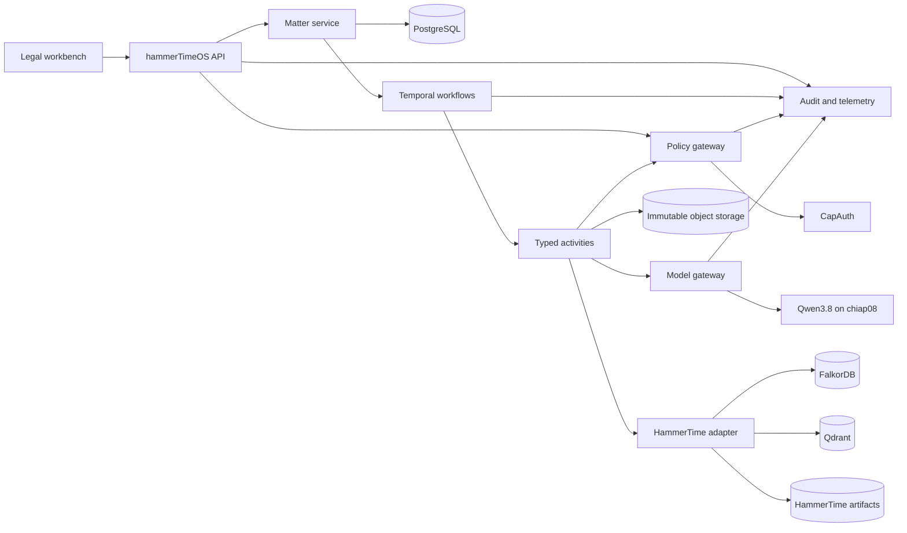

# hammerTimeOS target architecture

Date: 2026-08-19  
Status: Proposed baseline

## Executive decision

Build hammerTimeOS as a governed legal operations control plane around HammerTime. Do not copy the existing corpus into a new application database and do not rewrite the mature ingestion pipeline first.

The most important boundary is:

> HammerTime owns source artifacts, normalized corpus artifacts, provenance contracts, corpus releases, and existing retrieval projections. hammerTimeOS owns legal matter operations, policy enforcement, workflow durability, human approvals, and append-only run records.

This preserves the strongest parts of the current framework while creating a place for the features that a legal application must enforce: client and matter identity, conflicts, privilege, ethical walls, authority applicability, deadlines, claim-level support, approval, and release controls.

## Architecture principles

1. **Evidence before inference.** A model output is a proposal linked to evidence, never a canonical fact merely because it is structured.
2. **One owner per class of state.** Files and corpus releases have one canonical owner. Operational records have another. Indexes are always derived.
3. **Deterministic control, bounded models.** Durable workflows and policy checks decide what may happen. Models propose content inside a typed envelope.
4. **Authority is applicability, not similarity.** Retrieval may search broadly, but a claim becomes usable only after jurisdiction, forum, time, authority status, and remedy checks.
5. **Private data is partitioned before retrieval.** Conflict, privilege, tenant, matter, and ethical-wall filters apply before any model sees context.
6. **Human approval is a state transition.** It is not a sentence in a prompt.
7. **Every important result is reproducible.** A run records model identity, prompt version, corpus release, jurisdiction pack, tool grants, source versions, and policy decisions.
8. **Compatibility precedes migration.** Existing `PRB-*`, `INC-*`, paths, and scripts remain usable until parity is demonstrated.

## System view



## Ownership boundaries

| State or artifact | Canonical owner | Notes |
|---|---|---|
| Original source and intake custody | HammerTime | Preserve the existing `Inbox/` completion and archive contract. |
| Normalized text, decomposition, provenance, corpus release manifest | HammerTime | Imported by immutable identifier and content hash. |
| Matter, engagement, party roles, tasks, deadlines, workflow state | hammerTimeOS PostgreSQL | Structured operational records only. |
| Claim and fact proposals | hammerTimeOS PostgreSQL | Versioned, source-linked, and approval-gated. |
| Original private matter files in a future managed application | Immutable object store | HammerTime remains the initial owner. Migration requires a manifest and chain-of-custody proof. |
| Semantic vectors | Qdrant | Derived and rebuildable from a named corpus release. |
| Entity, claim, and citation graph | FalkorDB adapter | Derived and rebuildable. Keep the database replaceable. |
| Full-text search | PostgreSQL full-text search initially | Add OpenSearch only when measured relevance, scale, or operational needs justify it. |
| Agent memory | SKMemory | Session and agent continuity only, not canonical matter facts. |
| Capability grants | CapAuth | Short-lived, task-scoped grants checked at the tool boundary. |
| Workflow history | Temporal | Durable execution history, not the legal record itself. |
| Audit evidence | Append-only audit store | Correlates API, policy, workflow, model, retrieval, and release events. |

## Main components

### 1. Legal workbench

The workbench is matter-centered. It should expose intake, conflicts status, parties, proceedings, issues, facts, evidence, authorities, deadlines, tasks, work products, claim support, reviewer challenges, and release approvals.

The strongest reusable UI concepts from doc.haus are its matter and conversation layout, source citation viewer, contract review grid, DOCX redline workflow, and editable workflow or agent definitions. They should be extracted behind hammerTimeOS APIs. The doc.haus per-matter SQLite database, local MiniLM index, and OpenCode permission model must not become the system of record or authorization boundary.

### 2. Matter service

The matter service owns typed legal operations data in PostgreSQL. It does not store a second uncontrolled copy of the HammerTime corpus. Corpus references use immutable artifact IDs, release IDs, hashes, and locations.

PostgreSQL should use row-level security as defense in depth, but CapAuth and application policy remain required. Sensitive fields should support envelope encryption and independent key rotation. Every table carrying matter data includes `tenant_id`, `matter_id`, classification, provenance or creator, created time, observed time, and version.

### 3. HammerTime adapter

The first adapter is read-only except for an explicitly approved release command path. It provides:

- corpus release and alias lookup
- artifact and provenance lookup
- source-linked decomposition reads
- Qdrant retrieval through existing collection contracts
- FalkorDB graph queries through existing graph contracts
- legacy matter discovery under `incidents/problems/`
- translation of legacy ownership metadata into typed legal roles
- bounded status checks backed by materialized metadata, not full-tree scans

The adapter owns compatibility with current paths. New domain code must not depend on `incidents/problems/{slug}` or Markdown frontmatter directly.

### 4. Durable workflow layer

Temporal is the outer workflow engine for long-running, retryable, human-interrupted work such as ingestion, research, evidence review, drafting, and release. Workflow code stays deterministic. File access, database calls, model calls, and external requests occur in activities.

PydanticAI is the initial typed model and activity integration layer. Do not add LangGraph in the first slice. Temporal plus PydanticAI already covers durable workflow, typed inputs and outputs, tool mediation, and human pauses. Add a graph-style inner orchestrator only when a measured use case needs dynamic cyclic planning that cannot be expressed cleanly as Temporal child workflows or bounded Pydantic graphs.

### 5. Policy and capability gateway

All model and user tool calls pass through one gateway. CapAuth supplies identity and task-scoped capability tokens. The policy layer evaluates:

- tenant and matter membership
- conflict and ethical-wall decisions
- privilege and work-product classification
- source classification and export restrictions
- allowed tool, operation, resource, and field set
- allowed model and egress route
- budget, token, time, and concurrency limits
- approval required for the proposed transition

OPA is a reasonable later policy implementation if rules outgrow the application policy package. It should not duplicate CapAuth identity or grant issuance.

### 6. Retrieval and authority engine

Retrieval is a pipeline, not a vector lookup:

1. authorize the matter and corpus partitions
2. determine task, forum, jurisdiction, relevant time, and authority role
3. run lexical, metadata, semantic, and graph retrieval
4. fuse and rerank results
5. verify quotations and exact source locations
6. evaluate authority status and applicability
7. attach retrieval trace and negative-result notes
8. hand only allowed context to the model

Qdrant remains the semantic store. PostgreSQL full-text search is sufficient for the first slice. The existing custom embedding remains a candidate, not an accepted quality baseline, until it passes a held-out retrieval evaluation.

### 7. Model gateway

The gateway pins provider, endpoint, model alias, model file hash when available, prompt version, thinking mode, context budget, output schema, and timeout. It exposes roles, not unrestricted chat:

- `corpus_analyst`
- `issue_spotter`
- `claim_extractor`
- `authority_applicability_reviewer`
- `adversarial_challenger`
- `drafting_assistant`

The live Qwen3.8 server currently exposes four unified-KV slots and one model alias. Admission control must reserve capacity for interactive work, cap simultaneous long-context requests, and queue batch work. Persistent agent personas provide no value here. Use short-lived tasks with explicit context and typed results.

The abliterated model is acceptable as a local bounded analyst because the current HammerTime route already constrains its role and has strong runtime qualification. It is not an independent final reviewer. High-risk work ultimately needs a second, materially distinct model or human review path, with blind challenges where practical.

### 8. Audit and observability

Every request receives a correlation ID that spans the API, Temporal workflow, activity, policy decision, retrieval trace, model call, human action, and release event.

Required telemetry includes:

- queue depth and age by task class
- slot utilization and long-context contention
- model latency, token use, schema failures, retries, and cancellations
- retrieval Recall@k, nDCG, MRR, citation precision, and zero-result rate
- policy allow and deny counts without leaking protected content
- workflow retry, compensation, and stuck-run counts
- corpus release lag and index projection lag
- human rejection and material-edit rates
- provenance completeness and orphan reference counts

Prompt text and retrieved passages must not be sent to an external telemetry service by default.

## Data and event flow

### Corpus ingest

1. HammerTime receives a source under its existing intake rules.
2. Deterministic extraction preserves hashes and provenance.
3. Required OCR or transcript QC runs.
4. Qwen performs only the semantic steps required by HammerTime policy.
5. HammerTime writes normalized and decomposed artifacts.
6. Release validation and the secondary gate run.
7. HammerTime promotes a corpus release and updates aliases.
8. hammerTimeOS receives or polls a release event and updates artifact metadata.
9. Qdrant and FalkorDB projections are verified against the release manifest.

### Matter research and drafting

1. A user opens an authorized matter and requests a work product.
2. The policy gateway issues a narrow task capability.
3. Temporal records the request and starts a typed workflow.
4. Retrieval executes against a pinned corpus release and matter corpus snapshot.
5. Qwen returns proposals with source references and uncertainty fields.
6. Deterministic validators reject missing citations, invalid source locations, or disallowed authorities.
7. A challenge activity tests the strongest counterposition and missing evidence.
8. A human reviews the claim ledger and proposed work product.
9. Approval creates a signed release event. Rejection records reasons and returns the work item for revision.

## Consistency model

PostgreSQL commits operational state first. An outbox row records the projection work. Workers update Qdrant, FalkorDB, and optional search indexes idempotently. A projection watermark records the source release and event offset.

The application must never use a distributed transaction across PostgreSQL, the filesystem, Qdrant, and FalkorDB. Instead it uses immutable identifiers, idempotency keys, an outbox, reconciliation jobs, and visible lag.

HammerTime file writes remain under its existing release contract. hammerTimeOS treats a promoted release manifest as the integration boundary.

## Security model

The current profile ownership fields are navigation metadata, not authorization. The target security model adds:

- tenant isolation
- client and matter membership
- role and purpose limitation
- conflicts decisions and waivers
- ethical walls with explicit membership
- privilege and work-product labels at document, chunk, and output level
- legal hold and retention policy
- model egress policy
- redaction and export controls
- immutable approval and release history

Fail closed if a policy decision is missing. Retrieval filters must be enforced in the data access layer, not added to prompts.

## Proposed repository shape

```text
hammerTime-OS/
  apps/
    web/
  services/
    api/
    worker/
  packages/
    domain/
    policies/
    audit/
    model_gateway/
    retrieval/
    connectors/
      hammertime/
  workflows/
  agents/
    specs/
    schemas/
  jurisdiction_packs/
  evals/
    retrieval/
    legal_tasks/
    safety/
  migrations/
  deploy/
  docs/
```

Suggested baseline is Python 3.12, FastAPI, Pydantic 2, SQLAlchemy 2 or psycopg 3, PostgreSQL, Temporal Python SDK, PydanticAI, OpenTelemetry, and a React or TypeScript workbench. Pin all dependencies and add one root development and test workflow before application code lands.

## Decisions to lock before implementation

1. Confirm the canonical tenant, client, engagement, and matter hierarchy.
2. Define whether private matter originals remain in HammerTime for the first release or move to managed immutable storage.
3. Define the conflict-check and ethical-wall decision model with responsible human owners.
4. Approve the exact Qwen derivative and base-model license chain for the intended deployment.
5. Decide whether FalkorDB's current license is acceptable for deployment and distribution. Preserve a graph adapter either way.
6. Select the independent review path for high-risk outputs.
7. Approve the first jurisdiction and practice-area vertical slice.

## Explicit non-goals for the first slice

- migrating the entire HammerTime corpus
- autonomous filing, emailing, service, or client communication
- model-issued access decisions
- unrestricted model tools or shell access
- a general multi-agent swarm
- simultaneous adoption of Temporal, LangGraph, and PydanticAI orchestration
- OpenSearch before retrieval evaluation demonstrates a need
- Catala, OpenFisca, Akoma Ntoso, or LegalRuleML as the canonical internal model

