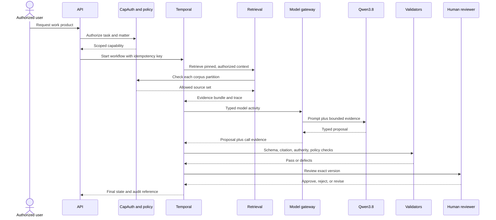

# Agentic harness design

Date: 2026-08-19  
Status: Proposed

## Design position

hammerTimeOS should not model the product as a room full of persistent agents. It should model legal work as durable workflows containing short-lived, typed, policy-gated model activities.

An agent is therefore:

```text
versioned task specification
+ authorized context snapshot
+ bounded tools
+ selected model route
+ typed output contract
+ deterministic validators
+ review and approval policy
+ complete run evidence
```

The workflow owns state. The model never owns state.

## Control flow



## Run envelope

Every activity receives an immutable run envelope:

```json
{
  "run_id": "uuid",
  "workflow_id": "uuid",
  "matter_id": "uuid",
  "tenant_id": "uuid",
  "task_type": "claim_extraction",
  "task_spec_version": "claim_extraction@1.0.0",
  "requested_by": "principal-id",
  "capability_id": "capability-id",
  "corpus_release_id": "prod-release-id",
  "matter_snapshot_id": "snapshot-id",
  "jurisdiction_pack_versions": ["us-il-state@1.0.0"],
  "model_route": "qwen38-local-analyst",
  "model_alias": "qwen3.8-27b-huihui-abliterated-q4_k_m",
  "model_artifact_hash": "pinned-sha256",
  "prompt_version": "sha256",
  "output_schema": "ClaimProposal@1.0.0",
  "allowed_tools": ["corpus.search", "artifact.read"],
  "budgets": {
    "input_tokens": 120000,
    "output_tokens": 6000,
    "wall_seconds": 300,
    "tool_calls": 12
  },
  "created_at": "timestamp"
}
```

Secrets and raw capability tokens are referenced, not copied into prompts or durable workflow history.

## Agent specification

Specifications belong in versioned files and should include:

- purpose and non-purpose
- accepted input schema
- required context fields
- allowed corpus roles and classifications
- allowed tools and operations
- model route and reasoning setting
- context and cost budgets
- expected output schema
- deterministic validation rules
- retry classes and maximum attempts
- escalation and human-review rules
- prohibited claims and state transitions
- evaluation set and minimum score

Prompt prose is only one part of the specification.

## Role catalogue

### Intake classifier

Classifies already preserved material into proposed document roles. It cannot move the original, approve ingestion, or override OCR and transcript QC.

### Corpus analyst

Extracts proposed entities, claims, citations, and relationships from selected source content. It cannot promote a corpus release or write directly to canonical HammerTime paths.

### Issue spotter

Produces candidate issues and missing-information questions. It is intentionally high recall and its outputs remain unaccepted proposals.

### Authority applicability reviewer

Tests a proposed authority against the matter's legal order, jurisdiction, forum, time, authority status, governing law, parties, consent, subject matter, and remedy. Similarity alone cannot pass this activity.

### Adversarial challenger

Receives the proposed claims and source bundle, ideally without the first model's reasoning trace. It identifies unsupported assertions, contrary authority, alternative interpretations, missing facts, procedural obstacles, and requested-relief gaps.

### Drafting assistant

Drafts only from a claim ledger that has reached `draft_ready`. It cannot introduce uncited legal or factual propositions. New propositions are returned to the claim workflow.

### Citation verifier

Prefer deterministic parsers and exact source checks. A model may flag ambiguous citations but cannot declare a quotation verified without matching the cited source span.

## Tool gateway

Tools expose domain operations, not general shell or filesystem access. Examples:

```text
corpus.search
corpus.get_artifact
corpus.get_release
matter.get_snapshot
claim.propose
authority.get_status
citation.verify_span
deadline.calculate
work_product.submit_for_review
```

Every tool request is evaluated against:

- principal
- task and purpose
- tenant and matter
- resource classification
- operation and fields
- model egress route
- workflow state
- budget
- approval preconditions

The gateway validates arguments before execution and validates results before returning them to a model. Tool output is treated as untrusted content for prompt-injection purposes.

## Model route policy

### Qwen3.8 local analyst

The current live endpoint on chiap08 reports:

- model alias `qwen3.8-27b-huihui-abliterated-q4_k_m`
- four unified-KV slots
- a 262,144-token slot context
- a pinned local GGUF and projector in the HammerTime production qualification record

The runtime qualification is strong evidence for transport, long-context recall, structured JSON, tool syntax, thinking controls, vision, concurrency, and rollback. It is not evidence of legal correctness, citation accuracy, retrieval quality, privilege behavior, or resistance to matter-specific prompt injection.

Policy for the first slice:

- allow only selected context, typed output, and domain tools
- deny shell, arbitrary network, email, filing, document deletion, corpus promotion, and release tools
- route substantive HammerTime corpus interpretation through the existing approved Qwen path
- reserve at least one live slot for interactive work
- allow at most one very-long-context job at a time until contention tests establish a safer limit
- queue batch extraction separately from interactive analysis
- cancel or checkpoint around known server maintenance windows
- record model and prompt identity on every result

Because this checkpoint is abliterated, instruction-following safety claims should be assumed weaker than for its base model until tested. The containment model must work even when the model follows a malicious instruction found in a document.

### Independent review

Repeating the same prompt against the same checkpoint is not independent review. For consequential outputs, use one or more of:

- a qualified human reviewer
- a materially different model family and checkpoint
- a deterministic authority, citation, or deadline validator
- a blind adversarial review using a different context presentation

The first release may rely on human review plus deterministic validators while a second model is qualified. It must label same-model challenge as variance testing, not independent assurance.

## Workflow pattern

Use Temporal for the outer durable state machine. Use Pydantic models for all workflow and activity boundaries. Use PydanticAI only inside model activities.

```text
Start request
  -> authorize
  -> pin matter and corpus snapshots
  -> retrieve
  -> propose
  -> validate
  -> challenge
  -> repair or escalate
  -> human review
  -> approve exact version
  -> release
```

Rules:

- Workflows contain no direct I/O and no non-deterministic model logic.
- Activities are idempotent or use idempotency keys.
- Retries distinguish transient failure, schema failure, policy denial, missing evidence, and substantive rejection.
- Policy denials are not retried automatically.
- Missing authority or evidence results in an explicit incomplete state, not fabricated content.
- Human waits have reminders and escalation, not infinite worker occupancy.
- Compensation never deletes source evidence. It marks projections stale or superseded.

## Proposal reducer

Model activities return proposals. A deterministic reducer may commit a proposal only when:

1. schema version is supported
2. referenced artifacts exist in the pinned snapshots
3. cited spans match accessible source content
4. jurisdiction and authority fields are present where required
5. policy allows the destination fields
6. no duplicate idempotency key has been committed
7. required reviewer or approval is recorded

The reducer writes the proposal and its defects. It does not silently drop uncertainty or counter-support.

## Hard gates

### CORPUS_READY

- source provenance complete
- required OCR or transcript QC complete
- decomposition schema valid
- release manifest valid
- vector and graph projection watermarks known
- no unreviewed sensitive-data publication defect

### CONTEXT_READY

- matter and corpus snapshots pinned
- conflict state allows work
- user and agent have matter access
- privilege and ethical-wall filters applied before retrieval
- retrieval trace persisted
- task jurisdiction and time scope present

### CLAIM_READY

- every material factual proposition has evidence support or an explicit unsupported flag
- every material legal proposition has authority support or an explicit unsupported flag
- exact quotations and citations verified
- authority status and applicability evaluated
- counter-support and unresolved questions preserved
- challenge completed

### DRAFT_READY

- only qualified claims enter drafting context
- requested remedy or objective linked to supporting claims
- procedural and deadline checks complete where relevant
- no disallowed source classification enters the target audience context

### RELEASE_READY

- exact artifact hash approved
- required reviewer capability valid
- citations and source snapshot unchanged since validation
- conflict and ethical-wall policy still allows release
- destination and egress route authorized
- immutable release record created

No model output may waive a failed gate.

## Retrieval evaluation and custom embeddings

The existing `bge-legal-v2` record reports 57,491 training pairs, but its evaluation contains only a few pairwise cosine similarities. Several post-training scores moved downward. Some downward movement may be intentional separation, but the current record does not define the expected direction, a held-out set, leakage controls, or end-to-end retrieval metrics.

Do not treat that file as production qualification. Build a gold evaluation with at least these slices:

- exact citation and quotation lookup
- semantic paraphrase
- legally distinct near-neighbors
- jurisdiction mismatch
- authority hierarchy mismatch
- superseded authority
- facts versus authority
- privileged versus public partitions
- OCR and transcript noise
- long document section retrieval
- no-answer queries
- adversarial document instructions

Report Recall@k, nDCG@k, MRR, precision after reranking, citation-span accuracy, cross-partition leakage, and latency. Compare the custom model with its BGE-M3 base on the same frozen set. Use shadow collections and a reversible alias switch for any promotion.

## Observability and audit schema

One `run_id` correlates:

- request and actor
- policy inputs and decision ID
- workflow and activity attempts
- corpus and matter snapshots
- retrieval queries, filters, result IDs, and scores
- model route, identity, token counts, duration, and schema outcome
- validator defects
- human decisions
- released artifact hash and destination

Audit logs store hashes or identifiers in place of protected content where possible. Access to detailed traces follows the same matter and ethical-wall policy as the source.

Operational alerts should cover:

- oldest queued interactive job
- all four model slots occupied beyond a threshold
- projection lag above a release threshold
- repeated schema repair loops
- elevated human rejection or material-edit rate
- citation verification regression
- policy service failure
- orphaned workflow or proposal records
- corpus status checks that exceed a bounded time budget

The current corpus status path can scan tens of thousands of decomposition files and become slow. Build a materialized corpus metadata table and make health checks bounded. Deep reconciliation belongs in a scheduled job.

## Prompt-injection posture

Legal documents, emails, web content, OCR text, and retrieved chunks are data, not instructions. The harness must:

- separate system policy, task instructions, tool results, and source content
- label source boundaries and source IDs
- deny tool requests inferred only from document content
- scan and flag instruction-like text without assuming a classifier is sufficient
- constrain output to a schema and revalidate every tool request
- test indirect prompt injection in the evaluation suite
- never place a long-lived credential in model context

## Framework simplification

Start with Temporal plus PydanticAI, not Temporal plus LangGraph plus PydanticAI. Start with PostgreSQL full-text search plus existing Qdrant, not OpenSearch plus another new vector store. Start with the existing FalkorDB adapter, but keep graph use optional and derived. Start with human plus deterministic independent checks, then qualify a second model. This keeps the assurance model understandable while the legal domain and corpus contracts stabilize.

