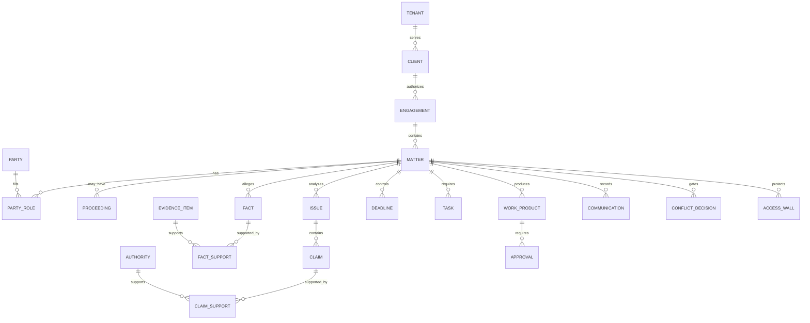

# Legal domain model

Date: 2026-08-19  
Status: Proposed

## Why the vocabulary must change

HammerTime currently uses an ITIL-shaped `Problem` and `Incident` structure to organize legal case work. It is effective as a file layout, but it conflates several legal concepts:

- a client engagement
- a legal matter
- a proceeding in a particular forum
- an event or communication
- an issue, claim, defense, or remedy
- a task or deadline
- a work product and its approval state

Renaming `Problem` to `Matter` is useful. Renaming every `Incident` to `Proceeding` is not safe because current incidents may represent counterparties, events, communications, or work items. Migration must classify by semantics and preserve the legacy record.

## Aggregate model



## Core entities

### Tenant, client, and engagement

- **Tenant** is the organizational security and retention boundary.
- **Client** is the represented or served person or organization.
- **Engagement** records the authorized scope, responsible professional, terms, start and end, and conflict decision.
- **Matter** is a bounded body of legal work under an engagement.

An engagement must exist before a matter becomes `active`, unless an explicitly modeled exception and approval apply.

### Matter

Minimum fields:

```text
matter_id                 UUID
tenant_id                 UUID
client_id                 UUID
engagement_id             UUID
matter_number             human-readable stable identifier
title                     text
matter_type               controlled vocabulary
practice_area             controlled vocabulary
status                    MatterStatus
responsible_professional  principal
team_members              principals
confidentiality           classification
conflict_state            ConflictState
privilege_policy_id       policy reference
retention_policy_id       policy reference
opened_at                 timestamp
closed_at                 timestamp optional
legacy_problem_id         text optional
legacy_path               text optional
version                   integer
```

### Proceeding and forum

A proceeding is a formal or quasi-formal track within a matter. A single matter may have no proceeding, one proceeding, or several proceedings.

Fields should distinguish court, tribunal, agency, arbitration, administrative process, transaction, investigation, and negotiation. Forum and jurisdiction are structured records, not prompt strings.

### Party and party role

Party identity is separated from a role in a matter or proceeding. The same party may be client in one matter and adverse party in another. Role history is effective-dated.

Minimum roles include client, prospective client, adverse party, co-party, counsel, court, judge, witness, expert, custodian, beneficiary, fiduciary, regulator, service provider, and related person.

Conflict checking operates over normalized party identity and relationship edges, not profile display names alone.

### Issue, claim, and defense

- **Issue** is a question requiring resolution.
- **Claim** is a proposition that may appear in analysis or a work product.
- **Cause of action, defense, element, remedy, and requested relief** are typed claim roles or linked legal concepts.

Each claim maintains a ledger:

```text
claim_id
matter_id
issue_id
text
claim_type
status
author_or_model_run
jurisdiction_scope
time_scope
authority_support[]
evidence_support[]
counter_support[]
qualifications[]
unresolved_questions[]
review_history[]
```

A claim record is a proposal until validators and reviewers advance its status.

### Fact and evidence

A fact is an assertion. Evidence is a preserved item that may support, contradict, or contextualize an assertion. Keep these separate.

Fact support records include source location, support direction, extraction method, confidence, reviewer, and any hearsay, authentication, completeness, or chain-of-custody flags selected by a qualified workflow. Evidentiary rules must come from the matter's forum and jurisdiction pack. The current evidence template must not assume the Federal Rules of Evidence for every matter.

Evidence items use immutable source versions. Corrections create a new version and retain the prior hash and lineage.

### Authority

An authority record needs more than citation text:

```text
authority_id
source_document_id
legal_order
jurisdiction
issuing_body
forum
authority_kind
authority_role
citation
decision_or_issue_date
effective_from
effective_to
observed_at
status
status_source
precedential_weight
territorial_scope
subject_scope
party_or_consent_scope
governing_law_scope
remedy_scope
source_locations[]
```

Use bitemporal fields where authority status can change. `effective_from` and `effective_to` represent legal validity. `observed_at` and version history represent when the system learned or recorded the status.

The authority engine must distinguish source role:

- primary authority
- secondary authority
- evidence
- party statement
- client instruction
- internal work product
- template
- asserted theory
- model output

Only records explicitly typed as authority participate in authority hierarchy checks.

### Deadline and task

A deadline records the triggering event, governing rule or order, calculation inputs, calculated due time, timezone, confidence, reviewer, and supersession history. A task records responsibility and work state. They are linked but not interchangeable.

No model-created deadline becomes operative without deterministic calculation where possible and human confirmation for consequential dates.

### Work product and approval

A work product is versioned and linked to its requested purpose, audience, source snapshot, claim set, citation verification result, challenge result, and approval history.

Approval records include approver identity, capability used, exact version hash, decision, reasons, time, and any conditions. Editing an approved artifact creates a new version and invalidates release approval until reapproved.

## State machines

### Matter

```text
proposed
  -> intake
  -> conflict_hold
  -> active
  -> stayed
  -> closing
  -> closed
  -> reopened
```

Activation requires an engagement and an allowed conflict state. `conflict_hold` blocks private retrieval and substantive model work except explicitly authorized conflict analysis.

### Document or evidence item

```text
received -> preserved -> normalized -> classified -> indexed -> validated
                                  \-> quarantined
```

### Claim

```text
proposed -> source_linked -> applicability_checked -> challenged
         -> qualified -> draft_ready -> accepted
                                 \-> rejected
```

`draft_ready` requires source support, quote verification, authority applicability, contradiction review, and policy clearance.

### Work product

```text
requested -> researching -> drafting -> validating -> human_review
          -> approved -> released -> superseded
                         \-> rejected
```

## Legacy translation

| Current HammerTime term | Target term | Migration rule |
|---|---|---|
| Problem | Matter | One-to-one default. Preserve `problem_slug`, `PRB-*`, and canonical path as aliases. |
| Problem owner | Responsible professional or matter owner | Map profile identity, then require a verified principal. |
| Root cause | Factual issue, causal theory, or platform root cause | Do not migrate automatically. Legal records require semantic classification. Keep root cause only for SK ITIL operations. |
| Incident | Matter event, communication, task, evidence event, or proceeding | Classify by content. Never map all incidents to one target class. |
| Incident registry | Matter register | Generate from canonical matter data and retain legacy references. |
| Incident priority | Urgency and risk | Split into deadline urgency, client impact, legal exposure, and operational priority. |
| Resolution | Disposition, outcome, completed action, or superseding event | Classify and preserve source text. |
| SLA | Deadline or service standard | Keep the source and calculation basis. |
| Known error | Known issue or validated limitation | Use only for platform operations or a clearly labeled matter limitation. |
| Change record | Work-product revision, filing event, or platform change | Select by domain. |
| Profile owner metadata | Matter team and party-role links | Ownership metadata seeds migration but does not grant access. |

SKCapstone ITIL remains appropriate for platform incidents, service degradation, infrastructure changes, and operational problem management. It should not be the canonical legal matter vocabulary.

## Compatibility adapter contract

The adapter emits a `LegacyMatterSnapshot` with:

- legacy IDs and paths
- frontmatter values
- profile ownership and relationship fields
- source artifact references
- content hashes
- classification warnings
- ambiguous incident records that require review
- import timestamp and adapter version

Imports are idempotent by legacy path plus content hash. They never delete or rewrite the source. A migration decision records the human or deterministic rule that assigned each legacy record to a target entity.

## Policy-relevant labels

Labels must be enforced at document and chunk granularity:

- public
- internal
- client confidential
- privileged
- work product
- common-interest restricted
- ethical-wall restricted
- sealed or court-restricted
- personally sensitive
- secret credential, which must never enter the corpus

Classification inheritance is conservative. A generated output inherits the most restrictive input label unless a documented declassification or redaction decision applies.

## Jurisdiction packs

A versioned jurisdiction pack may provide:

- court and forum identifiers
- authority hierarchy rules
- citation formats and parsers
- procedural calendars and deterministic deadline rules
- evidence-rule references
- official source connectors
- status and citator adapters
- local terminology
- validation scenarios

Jurisdiction packs are policy and connector packages, not free-form prompts. Every run pins exact versions. Community skills or templates enter only after license, source, security, and legal-content review.

## Initial API boundaries

```text
POST /matters
POST /matters/{id}/conflict-decisions
POST /matters/{id}/memberships
POST /matters/{id}/sources:link
POST /matters/{id}/research-runs
GET  /matters/{id}/claims
POST /claims/{id}/reviews
POST /work-products
POST /work-products/{id}/approvals
POST /work-products/{id}:release
GET  /runs/{id}/evidence
```

Each mutation accepts an idempotency key and a capability token. Release and approval endpoints require exact artifact hashes.

